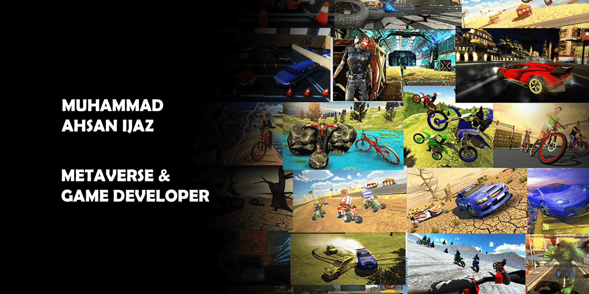

# Hi, I'm Ahsan 👋

- [MY PINNACLE (Jira board integration in VR)](https://www.youtube.com/watch?v=De56R7NSxTc&list=PLDWvssiSJ8Vrp3JdpT9nCY__r8RmxGCtB&index=2)

### I'm a Unity Game and Metaverse Developer and Researcher!
- 🔭 Expert in managing project development. working as a Backend and infra Engineer with Typescript and Python.
- 💻 8 years Experienced in Unity Developer and learning new edge cutting techniques.
- 👯 Specialized in building project from Scratch and Finalize till publishing.
- 📢 Have finished More than that 30+ project including 5 AAA projects.
- 🤔 I’m looking for help with creating portfolio for the unity developer.
- 📫 How to reach me: ahsan.ijaz.official@gmail.com
  2023 Goals:
- 🥅 Contribute more to Open Source projects on Github, Discord, StackOverFlow.
- 👯 Joined more than 10 Unity Discussion Platforms and helping others development problem.
- 🌱 Currently learning Photon Quantum.

<h2><i>💻 Tools & Technologies</i></h2>

<table width="100">
<tr>
    <td align='center' width="190">
        
    </td>
    <td align='center' width="190">
        
    </td>
    <td align='center' width="190">
        
    </td>
     <td align='center' width="190">
        
    </td>
    <td align='center' width="190">
        
    </td>
</tr>
<tr>
    <td align='center'>
        
    </td>
    <td align='center'>
        
    </td>
    <td align='center'>
        
    </td>
    <td align='center'>
        
    </td>
    <td align='center'>
        
    </td>
</tr>
<tr>
    <td align='center'>
        
    </td>
    <td align='center'>
        
    </td>
    <td align='center'>
        
    </td>
<td align='center'>
        
    </td>
    <td align='center'>
        
    </td>
    
</tr>
<tr>
    <td align='center'>
        
    </td>
    <td align='center'>
        
    </td>
    <td align='center'>
        
    </td>
    <td align='center'>
        
    </td>
    <td align='center'>
        
    </td>
</tr>
<tr>
    <td align='center'>
        
    </td>
    <td align='center'>
        
    </td>
    <td align='center'>
        
    </td>
    <td align='center'>
        
    </td>
    <td align='center'>
        
    </td>
</tr>

</table>

 
 
